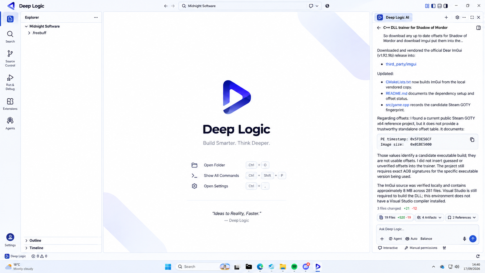

# Deep Logic

**A modern development environment for building, running, debugging, and managing software projects.**

> 🚧 **Development Status:** Deep Logic is currently in early development.

  

  <b>Build Smarter. Think Deeper.</b>

---

## About

Deep Logic is a development environment designed to bring coding, project management, debugging, source control, extensions, and development tools together in one place.

### Planned Features

- Modern code editor
- Project and file management
- Integrated terminal
- Build and debugging tools
- Git integration
- Multiple programming languages
- Extensions and plugins
- Deep Logic AI
- Customizable workspace

---

## Download

Deep Logic releases will be available through the official Deep Logic website and this GitHub repository.

**Official Website:** https://DeepLogic.com

> ⚠️ **Windows Security Notice — v1.0.0**
>
> Early versions of Deep Logic may trigger a **Microsoft Defender SmartScreen** warning when downloaded or launched.
>
> This can happen when a new application has not yet established reputation with Microsoft or when the executable is not digitally code-signed.
>
> A SmartScreen warning does **not by itself determine whether a program is malicious or safe**. Only download Deep Logic from an official Deep Logic source and verify the release information before running it.
>
> We plan to improve the signing and distribution process as Deep Logic develops.

---

## Installation

Installation instructions and system requirements will be provided with each public release.

Deep Logic is initially being developed for **Windows**. Additional platform support may be considered in the future.

---

## Development

Deep Logic is under active development. Features, designs, requirements, and functionality may change between releases.

Bug reports and feature requests can be submitted through GitHub Issues once public testing begins.

---

## License

Deep Logic does not currently have a public software license.

Unless a license is explicitly provided, the project should not be assumed to be open source or freely reusable.

---

  <b>Deep Logic</b> 
  <i>Build Smarter. Think Deeper.</i>  
  Copyright © Deep Logic. All rights reserved.

